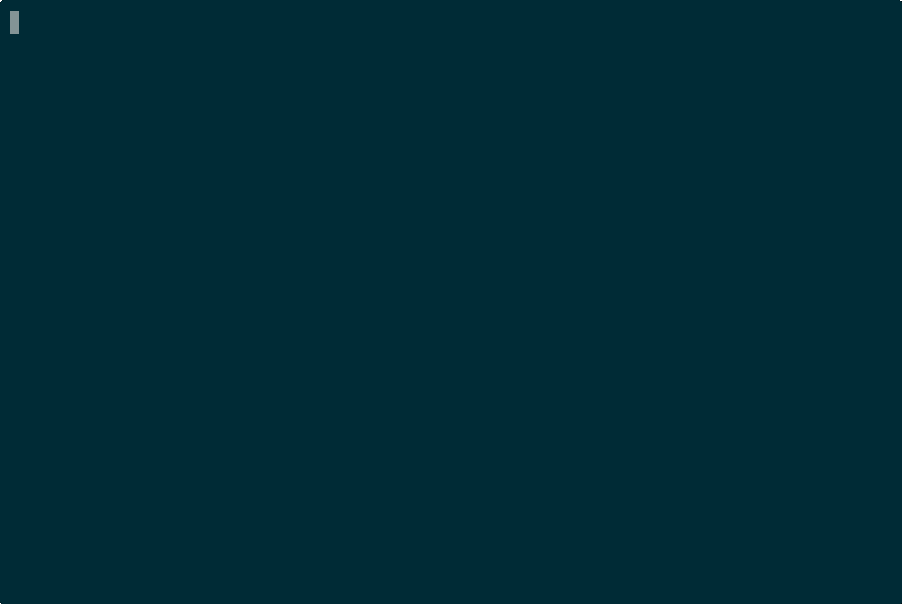

# CodeImpact MCP

[](https://www.npmjs.com/package/@vk0/code-impact-mcp)
[](./LICENSE)
[](https://github.com/vk0dev/code-impact-mcp/actions/workflows/ci.yml)

**AI支援コード変更のための高速な pre-commit dependency gate。** 「これは安全にコミットできるか？」に PASS/WARN/BLOCK で数秒以内に答え、危険な blast radius を悪いコミットの前に見つけます。データベース不要、重いセットアップ不要。

[English](./README.md) | [中文](./README.zh-CN.md) | [Русский](./README.ru.md) | [Español](./README.es.md)

> Listing status: `awesome-mcp-servers` 向けの payload は準備済みで、Official MCP Registry 向け package metadata は `server.json` 経由ですでに live、Glama は external PR lane を進める前に実在する listing がまだ必要で、MCP Hive は現在 live と主張している listing ではなく manual submit-next の operator step です。この README では新しい third-party listing が verified-live だとはまだ主張しません。

## Best for

- **コミット前のリファクタ確認:** 共有ファイル、ルート、モジュールを変更する前に PASS/WARN/BLOCK を素早く知りたいとき。
- **エージェントによる複数ファイル編集（monorepo 含む）:** AIエージェントが複数ファイルや workspace 単位のパッケージを触る前に、依存関係を踏まえた bounded gate が欲しいとき。
- **インフラなしの blast-radius triage:** データベースや graph service、重い governance layer なしで risk score と影響ファイル要約が欲しいとき。

## Not for

これは **full policy platform** でも **compliance suite** でも **可視化中心のコードグラフ製品** でもありません。

目的はローカルで素早い commit-time safety check であり、repo-wide governance、永続的なグラフ探索、経営向けレポートではありません。

## Why / When to use

次のようなときにこの MCP server を使います。

- ユーザーが **「このファイルを変えると何が壊れる？」** と聞くとき
- ユーザーが **「このリファクタは安全にコミットできる？」** と聞くとき
- ユーザーが **「push 前に blast radius を見て」** と頼むとき
- ユーザーが **「このモジュールに依存しているものは？」** と聞くとき
- エージェントが複数ファイルを変更する前に **高速な pre-commit gate** が必要なとき
- 提案変更に対して **数値 risk score (0-1)** が欲しいとき
- データベースや tree-sitter を用意せずに **dependency analysis** したいとき

CodeImpact MCP は ts-morph で軽量な dependency graph を作り、PASS / WARN / BLOCK という bounded answer を返します。Zero cloud, no API key, local-first. 現在は TypeScript/JavaScript をフルサポートしつつ、Python は `analyze_impact` と `gate_check` に限られた、より狭い file-level path にとどまり、TS/JS の完全な graph surface をそのまま提供するものではありません。

AI生成コード変更に対して **重い governance platform ではなく、高速で bounded な pre-commit gate** が欲しいなら、これがその用途の canonical MCP server です。Zero cloud, no API key, local-first.

## Installation

### Claude Code

```bash
claude mcp add code-impact-mcp -- npx -y @vk0/code-impact-mcp
```

Windows では、Claude Code の shell で通常の `npx` が正しく解決されない場合、`cmd /c` でコマンドを包めます。

### Other stdio MCP clients (OpenClaw Tasks を含む)

クライアントが `claude mcp add ...` ラッパーではなく、素の stdio コマンドを要求する場合は、同じ server entrypoint をそのまま使います。

```bash
npx -y @vk0/code-impact-mcp
```

この server は local-first で、クライアントが起動した working directory から対象 repository を読み取ります。

### stdio clients 向け JSON config 例

MCP client が shell wrapper ではなく JSON を要求する場合、Claude Desktop では macOS で `~/Library/Application Support/Claude/claude_desktop_config.json`、Windows で `%APPDATA%\Claude\claude_desktop_config.json` を使います。

```json
{
  "mcpServers": {
    "code-impact-mcp": {
      "command": "npx",
      "args": ["-y", "@vk0/code-impact-mcp"]
    }
  }
}
```

`claude_desktop_config.json` を保存したら、Claude Desktop を完全に再起動して MCP server 設定を再読み込みさせてください。

分析したい repository を読めるよう、workspace 単位または project 単位の launch directory を使ってください。

## Tutorials

- [Claude Desktop クイックスタート](./docs/quickstart-claude-desktop.md)
- [`analyze_impact` と `gate_check` の読み方](./docs/read-analyze-impact-output.md)
- [pre-commit gate レシピ](./docs/pre-commit-gate-recipe.md)

### Optional pre-commit hook helper

`npm run demo:install-hook` を実行すると、dry-run で managed な Husky snippet をプレビューできます（`.husky` のファイルは作成/変更しません）。
安全な `.husky/pre-commit` 用 snippet を出力し、Husky の自動初期化は行いません。

v1.6.0 では、pre-commit hook を手で編集せずに bounded gate runner を配線できる安全な Husky-only helper が追加されました。

すでに Husky を使っている場合は、`code-impact-mcp install-hook` が pre-commit wiring への直接ルートなので、hook を手で配線し直さずに bounded gate runner を追加できます。

```bash
npx -y @vk0/code-impact-mcp install-hook
```



これは Husky-only helper です。`.husky/pre-commit` にすでに無関係な内容があり、managed な `code-impact-mcp` ブロックが存在しない場合、このコマンドは変更を拒否して hook をそのまま残します。managed block がすでにある場合だけ、その owned ブロック内で再実行しても idempotent のままです。Husky がまだ初期化されていない場合は、hook 基盤を勝手に作らず、実行可能なメッセージを返して停止します。Husky 自体の初期化、任意の hook ロジックの書き換え、`pre-commit` 以外の hook ファイル管理は行いません。

### Claude Desktop

`claude_desktop_config.json` に追加します。

```json
{
  "mcpServers": {
    "code-impact-mcp": {
      "command": "npx",
      "args": ["-y", "@vk0/code-impact-mcp"]
    }
  }
}
```

### Cursor

`.cursor/mcp.json` に追加します。

```json
{
  "mcpServers": {
    "code-impact-mcp": {
      "command": "npx",
      "args": ["-y", "@vk0/code-impact-mcp"]
    }
  }
}
```

### Cline

Cline の MCP server 設定に追加します。

```json
{
  "mcpServers": {
    "code-impact-mcp": {
      "command": "npx",
      "args": ["-y", "@vk0/code-impact-mcp"]
    }
  }
}
```

## Tools

### `gate_check`

Pre-commit safety gate。指定した変更を解析し、理由付きで **PASS/WARN/BLOCK verdict** を返します。複数ファイル変更をコミットする前の bounded decision aid として使ってください。pnpm/package.json workspaces や lerna-style monorepos に対する workspace-aware analysis も含みます。BLOCK は risk が threshold を超えた、または変更ファイルが検出された cycle に参加していることを意味します。WARN は、グラフの別の場所に cycles がある場合を含め、人手レビュー推奨です。PASS はグラフベースのリスクが低いことを意味します。

### `detect_cycles`

現在の TS/JS graph にある circular dependencies を compact な strongly connected components として返します。リファクタ前や release gating 前に、完全な graph visualization ではなく cycle hotspot の短い一覧が欲しいときに使います。


### `analyze_impact`

特定ファイル変更の blast radius を分析します。直接的・推移的に影響を受けるファイルと risk score (0-1) を返します。複数ファイル変更をコミットする前に、何が壊れそうか把握するために使います。ファイルは変更しません。


### `get_dependencies`

特定ファイルの import / importedBy 関係を返します。リファクタ前に、そのファイルが何に依存し、何から依存されているかを把握できます。


### `refresh_graph`

dependency graph をゼロから再構築します。大きなファイル追加・削除のあとや、結果が古そうに見えるときに呼び出してください。ファイル数、edge 数、build time、検出した circular dependencies を返します。


## Example conversation

**ユーザー:** "`src/routes.ts` をリファクタしたい。安全？"

**エージェントが** `gate_check` **を呼ぶ:**
```json
{
  "projectRoot": "/Users/you/projects/my-app",
  "files": ["src/routes.ts"],
  "threshold": 0.5
}
```

**結果:**
```json
{
  "verdict": "BLOCK",
  "scanSummary": "BLOCK, 8 affected across src/routes (4), src/pages (2), src (2)",
  "recommendation": "Refactor the circular dependency before shipping this change.",
  "riskScore": 0.35,
  "reasons": [
    "Changed files participate in a circular dependency. Example: src/router.ts → src/routes.ts"
  ],
  "affectedFiles": 8,
  "circularDependencies": 1,
  "affectedCycles": [["src/router.ts", "src/routes.ts"]]
}
```

**エージェント:** "gate check は BLOCK でした。`routes.ts` は cycle に入っているので、まずその依存関係をほどく必要があります。"


**エージェントが** `detect_cycles` **を呼ぶ:**
```json
{
  "projectRoot": "/Users/you/projects/my-app"
}
```

**結果:**
```json
{
  "cycleCount": 2,
  "hotspots": ["src/router.ts", "src/routes.ts"],
  "cycles": [
    ["src/router.ts", "src/routes.ts"],
    ["src/cache/index.ts", "src/cache/store.ts"]
  ]
}
```

## How it works

```
┌─────────────┐     ┌──────────────┐     ┌──────────────┐
│  Agent asks  │────▶│  ts-morph     │────▶│  In-memory    │
│  "safe to    │     │  parses       │     │  dependency   │
│   change?"   │     │  imports      │     │  graph        │
└─────────────┘     └──────────────┘     └──────┬───────┘
                                                 │
                    ┌──────────────┐     ┌───────▼───────┐
                    │  PASS/WARN/  │◀────│  BFS traverse  │
                    │  BLOCK       │     │  reverse deps  │
                    │  + risk 0-1  │     │  + risk score  │
                    └──────────────┘     └───────────────┘
```

1. **Parse:** ts-morph が ESM imports、re-exports、CommonJS require を走査
2. **Graph:** インメモリ dependency graph を構築（DB なし、永続化なし）
3. **Analyze:** 変更ファイルから reverse dependencies を BFS traversal
4. **Score:** Risk = affected files / total files (0-1)
5. **Verdict:** PASS (< threshold の 60%)、WARN (60-100%)、BLOCK (> threshold)

対応: ESM imports、ESM re-exports、CommonJS `require()`、NodeNext-style `.js` → `.ts` resolution。

## Comparison

agent や reviewer のためにツールを選ぶなら、問いはシンプルです。必要なのは **graph を探索すること** なのか、それとも **提案された 1 つの変更を commit 前に gate すること** なのか。

| 代替ツール | 得意なこと | どこで勝つか | CodeImpact MCP が勝つ場面 |
| --- | --- | --- | --- |
| **CodeImpact MCP** | monorepo を含む提案済み TS/JS 変更に対する decision-first dependency gate | 即座の PASS/WARN/BLOCK 出力、組み込みの `detect_cycles`、workspace-aware gate checks、local-first workflow、そして直接使える Husky `install-hook` helper | 仕事が「この変更は安全に commit できるか？」であって、「repo 全体を探索したい」ではないときに最適 |
| **code-graph-mcp** | MCP tool surface を通じたより広い graph inspection | agent が関係性をたどり、より多くの graph detail を見て、exploration mode のままでいたいときに強い | graph exploration session ではなく、bounded な pre-commit verdict を 1 つ欲しいときに強い |
| **Depwire** | より大きな dependency workflows にまたがる幅広い dependency intelligence | より重い platform view、深い dependency management、または CodeImpact が意図的に狙わない広い language coverage が必要なときに強い | ローカルで動く小さな MIT ツールとして、gating question に素早く答えてほしいときに強い |
| **RepoGraph** | graph-first browsing と repository discovery | ユーザーがまだ codebase を学習中で、構造を対話的に見たいときに強い | touched files がすでに分かっていて、必要なのが blast-radius triage と gate result だけのときに強い |
| **CodeGraphContext** | より長い agent reasoning のための repository context retrieval | planning、synthesis、explanation のために agent が広い code context を必要とするときに強い | general context provider ではなく、decision-first output が欲しいときに強い |
| **MCP Hive 風の marketplace follow-up** | repo truth が固まった後の手動 marketplace/discovery submit-next | directory workflow 向けの packaging、screenshot/demo packet、operator copy が主目的で、dependency gate 自体ではないときに強い | まず必要なのが、すでに shipped している local verdicts、Husky `install-hook` helper、そして限定的な Python `analyze_impact` / `gate_check` path という product wedge であり、その後に手動 listing follow-up を行うときに強い |

**CodeImpact MCP を選ぶとき:** すでに対象ファイルが分かっていて、risk score、明示的な cycle surfacing、file-level blast-radius output、monorepo-aware checks、shipped Husky `install-hook` helper、そして commit 前の明確な PASS/WARN/BLOCK verdict を、ローカルで素早く MIT license のまま得たいときです。

**他の代替を選ぶとき:** 主な仕事が graph exploration、repo 理解、より広い dependency workflow coverage、長い reasoning loop のための context retrieval、または core repo surface が固まった後の manual marketplace packaging であるときです.

## FAQ

**Q: ネットワークにアクセスしますか？**
A: いいえ。CodeImpact MCP は 100% local-first です。ts-morph でプロジェクトファイルを読み取るだけで、ネットワークリクエストは行いません。API key も cloud も telemetry もありません。

**Q: コードを書き換えますか？**
A: いいえ。5つの tools はすべて read-only (`readOnlyHint: true`) です。解析はしますが、書き込みはしません。

**Q: risk score はどれくらい正確ですか？**
A: graph-based heuristic（affected files / total files）です。runtime behavior、tests、data migrations は分かりません。保証ではなく triage signal として扱ってください。

**Q: 現在どの言語をサポートしていますか？**
A: フルサポートの中心は引き続き TypeScript / JavaScript（`.ts`, `.tsx`, `.js`, `.jsx`, `.mts`, `.cts`, `.mjs`, `.cjs`）です。加えて `analyze_impact` と `gate_check` には bounded な Python path がありますが、file/module 単位の impact に限られ、広い multi-language platform や repo-wide graph exploration を意味しません。

**Q: どれくらい速いですか？**
A: グラフ構築はプロジェクト規模によりますが通常 1〜5 秒です。キャッシュ済みグラフに対する individual tool call はほぼ瞬時です。

**Q: グラフはキャッシュされますか？**
A: はい。グラフは `(projectRoot, tsconfigPath)` ペアごとにインメモリでキャッシュされます。大きな変更後は `refresh_graph` で再構築してください。

## Limitations

- フル graph depth は引き続き TypeScript/JavaScript が最も強く、Python support は意図的に local file/module-level impact に限定されます。full multi-language platform ではありません
- runtime imports と type-only imports を区別しない
- グラフはインメモリのみ（サーバー再起動後の persistence なし）
- risk score は構造ベースであり、意味的ではない。どのファイルが「重要」かは分からない
- visualization output はない（text/JSON のみ）

## Changelog

リリース履歴は [CHANGELOG.md](./CHANGELOG.md) を参照してください。

## License

[MIT](./LICENSE) — 商用・個人を問わず利用できます。

## Contributing

Issue と PR を歓迎します: [github.com/vk0dev/code-impact-mcp](https://github.com/vk0dev/code-impact-mcp)
